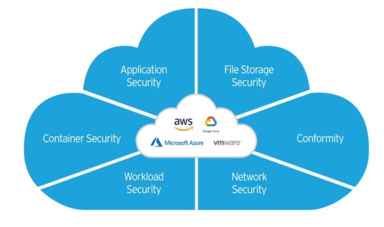

# SegurancaParaNuvem

Como posso ter proteção e visilidade para a minha nuvem em um unico lugar?

As perguntas abaixo estão relacionados aos desafios que a Plataforma do Cloud One ajuda a resolver.

 </img>
  
Como ter visibilidade e compliance em tempo real na minha infraestrutura na Cloud Pública?

- Só dar uma olhada aqui: <a href="https://github.com/SecurityForCloudBuilders/SegurancaParaNuvem/tree/main/SegurancaParaCloudESecOps/VisibilidadeNaCloud"> Visibilidade Na Cloud </a>

Como ter proteção nas minhas Container Image e Cluster Kubernetes?

- Venha ver aqui: <a href="https://github.com/SecurityForCloudBuilders/SegurancaParaNuvem/tree/main/SegurancaParaCloudESecOps/SeguracaParaContainer%26K8s"> SeguracaParaContainer&K8s </a> 

Como ter proteção em tempo real nas minhas Aplicações Web?

Como ter proteção contra vulnerabilidades, malware e compliance em EC2/ VM?

Como ter proteção nos meus Files Storages na Cloud?

- Enquanto toma um café, leia mais aqui: <a href="https://github.com/SecurityForCloudBuilders/SegurancaParaNuvem/tree/main/SegurancaParaCloudESecOps/SeguracaParaFileStorage"> SeguracaParaFileStorage </a>

Como ter proteção rapidamente nas VPCs & cloud network segments?
