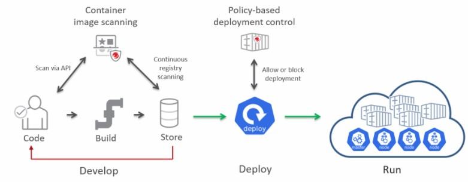

# Cloud One Container Security

A documentação para o Cloud One - Container Security encontra-se em:
* https://cloudone.trendmicro.com/docs/container-security/
* https://github.com/deep-security/smartcheck-helm

A documentação para a API do Cloud One - Container Security
* https://deep-security.github.io/smartcheck-docs/api/index.html

Para fazer um Trial de 30 dias grátis do Cloud One - Container Security e realizar Assessment de Malware, Compliance e Vulnerabilidades e Controle de Admissão das suas imagens:
* https://go2.trendmicro.com/geoip/trial-168
* https://cloudone.trendmicro.com/

<b>
:heart: O QUE É O CLOUD ONE - CONTAINER SECURITY 
</b>
 
O Container Security é ferramenta que ajuda os times de segurança e desenvolvimento no compliance e segurança da imagens, impedindo potenciais vazamentos de credenciais expostas e que aplicações vulneraveis sejam colocadas em produção. Alguns recursos do Container Security:
<li> Garantia que as imagens de contêiner sejam executadas apenas quando atenderem aos critérios de segurança que você definir.</li>
<li> O Container Security verifica Vulnerabilidades, Malwares, Compliance (NIST, PCI, HIPAA), Segredos, Chaves, Vulnerabilidades em bibliotecas open source (python, java, go) <li> Fornece controle de implantação baseado em políticas impedindo por exemplo um container executando como root, container com permissão para escalar privilegios, bloquear 
imagens não escaneadas além de criar exceções para imagens confiaveis.
 
 
<b>
:hand: COMO FUNCIONA O CLOUD ONE - CONTAINER SECURITY
</b>
  
O Smart Check (plugin de scan de imagens) realiza uma varredura nas imagens de imagens de contêineres como parte de seu pipeline de desenvolvimento para que os desenvolvedores possam detectar e corrigir problemas de segurança no início do ciclo de vida da imagem de contêiner. 
 
 
Após essa analise das imagens O Container Security fornece controle de implantação baseado em políticas por meio de uma integração nativa com o Kubernetes para garantir que as implantações do Kubernetes executadas em seu ambiente de produção sejam seguras.

 

:zap: COMO TESTAR 

 
 
<li/>Vulnerability-and-Malware-Assessment-for-Containers https://github.com/SecurityForCloudBuilders/Vulnerability-and-Malware-Assessment-for-Containers </li>
<li>Vulnerable-Image-DSSC https://github.com/SecurityForCloudBuilders/Vulnerable-Image-DSSC</li>
