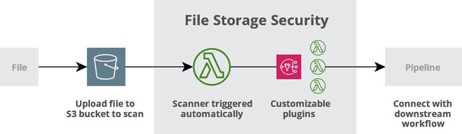
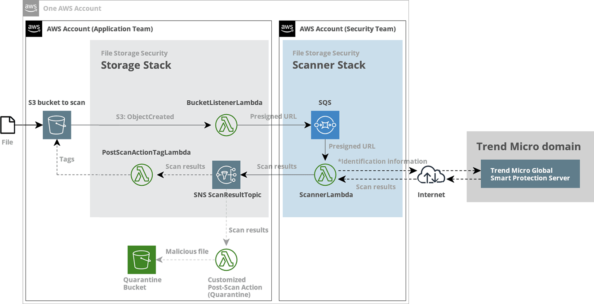
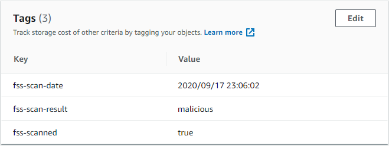

# Cloud One File Storage Security

### A documentação para o Cloud One - File Storage Security encontra-se em: 

    - https://cloudone.trendmicro.com/docs/file-storage-security/what-is-fss/

### A documentação para a API do Cloud One File Storage Security: A API Pública do File Storage Security te permite interagir de maneira programatica com o Cloud One File Storage Security. 

    - https://cloudone.trendmicro.com/docs/file-storage-security/api-reference/

### Para fazer um Trial de 30 dias grátis do Cloud One File Storage Security e testar a Segurança dos seus File Storage da Nuvem Pública:

    - https://cloudone.trendmicro.com/

 

  
:heart: O QUE É O CLOUD ONE - FILE STORAGE SECURITY 

 

<b>O QUE É O CLOUD ONE - FILE STORAGE SECURITY:</b>

O Trend Micro Cloud One – File Storage Security provêm anti-malware scanning em recursos no Amazon Simple Storage Service (Amazon S3) e outros Cloud Storage.

<ul>

<li> Proteja dados de armazenamento em nuvem </li>
<li> Aproveite as vantagens da verificação automatizada de malware </li>
<li> Reputação de arquivo: Bloqueie arquivos maliciosos conhecidos com assinaturas antimalware </li>
<li> Proteção de variantes: Procure variantes ofuscadas ou polimórficas de malware através de fragmentos de malware e algoritmos de detecção vistos anteriormente </li>
<li> Ampla flexibilidade: Suporte de varredura confiável para arquivos pequenos a grandes e suporte para qualquer tipo de arquivo </li>
<li> Automatiza a verificação de arquivos para ser acionada sempre que novos arquivos são carregados </li>
<li> Rapidamente comece a utilizar ao implantar a solução utilizando templates prontos </li>
<li> Permite a integração do workflow através de funções serverless </li>

</ul>

<b> Aproveite o suporte para os principais players: </b>

    - Amazon S3®, Microsoft Azure Blob* e Google Cloud Storage™*

<b> Os seguintes serviços são suportados: </b>

<i> <strong> Amazon S3 </strong> </i>

<b> Os seguintes serviços serão suportados em breve: </b>

<i> <strong> Azure Blob </i> </strong>

<i> <strong> Google Cloud Storage </i> </strong>

 

  
:hand: COMO FUNCIONA O FILE STORAGE SECURITY 

 

<b>COMO FUNCIONA O FILE STORAGE SECURITY? </b>

<b> Quando um usuário ou programa carrega um arquivo para um determinado S3 bucket, o File Storage Security executa um scan. O Scan só é executado no arquivo adicionado, não nos recursos existentes no bucket. </b> Quando o Scan é completo, seus plugins customizados ou <a href="https://cloudone.trendmicro.com/docs/file-storage-security/post-scan-action-create/"> Lambdas </a> pegam os <a href="https://cloudone.trendmicro.com/docs/file-storage-security/scan-tag-overview/"> resultados </a> da verificação e podem conectar-se com o seu fluxo downstream para processamento posterior.

<b> O File Storage Security pode detectar vários tipos de Malware incluindo vírus, trojans, spyware e mais. </b> 

 </img>

<b> Quanto tempo os scans levam? </b> 

<b> O tempo de Scan depende do tamanho e tipo de um arquivo, e pode variar de cerca de 3 a 25 segundos. </b> Para mais detalhes, veja <a href="https://cloudone.trendmicro.com/docs/file-storage-security/performance-scaling/#Metric"> Performance metrics (scan times). </a>

<b> Como a solução escala? </b> 

<b> Porque o File Storage Security scanner é um Lambda function, pode lidar com vários scans simultaneamente, e aumentará (ou diminuirá) automaticamente em resposta a aumentos (ou diminuições) na carga. </b> Para detalhes, veja <a href="https://cloudone.trendmicro.com/docs/file-storage-security/performance-scaling/"> Performance and scaling. </a>

<b> Quais regiões são suportadas? </b> 

O File Storage Security pode residir em qualquer região da Amazon Web Services (AWS), exceto:

<ul>

<li> China (Beijing) </li>
<li> China (Ningxia) </li>
<li> AWS GovCloud (US) </li>
<li> Asia Pacific (Hong Kong) </li>
<li> Asia Pacific (Osaka-Local) </li>

</ul>

<b> Conteúdo da Stack: </b>

<i> <strong> File Storage Security é implantado usando Templates do AWS CloudFormation. Você pode revisar esses Templates para ver quais recursos compõem cada Stack. </i> </strong>

<b> Esses Templates estão disponíveis para revisão no Github: </b>

    - https://github.com/trendmicro/cloudone-filestorage-cloudformation-templates

<b> Conexão com a Internet em um fluxo de Scan: </b> 

<i> <strong> Quando o scanner comunica, envolve dois tipos de comunicação para a internet via HTTPS port 443: </i> </strong>

    - Conexão para a Trend Micro Global Smart Protection Server (c1fss1.icrc.trendmicro.com);

    - Conexão para vários serviços da AWS, como S3, SQS e SNS;

<i> <strong> O Scanner pode acessar a Smart Protection Server durante um scan, e acessar os serviços da AWS durante um scan (S3 e SQS) e depois de um scan (SNS). Para os detalhes do fluxo, refira a <a href="https://cloudone.trendmicro.com/docs/file-storage-security/arch-overview/"> Arquitetura. </a> </i> </strong>

 </img>

    - Para saber mais:

        - https://cloudone.trendmicro.com/docs/file-storage-security/arch-overview/

<b> Monitore os Resultados das Scans: </b>

<i> <strong> Os Resultados dos Scans do File Storage Security podem ser encontrados no <a href="https://docs.aws.amazon.com/AmazonCloudWatch/latest/logs/WhatIsCloudWatchLogs.html"> AWS CloudWatch Logs. </a> </i> </strong>

    - Para saber mais:
        - https://cloudone.trendmicro.com/docs/file-storage-security/scan-tag-overview/

 

  
:zap: COMO TESTAR 

 

<b> COMO TESTAR: </b>

    1. Escaneie um Arquivo;
    2. (Opcional) Escaneie um Arquivo já existente no 'S3 bucket to scan';
    3. Veja os Resultados do Scan no CloudWatch;
    4. (Opcional)Seja notificado dos resultados do Scan por meio do SNS;
    5. (Opcional) Monitore por Arquivos Maliciosos usando o CloudWatch;
    6. (Opcional) Adicione Post-Scan Actions:
    

<b> Escaneie um Arquivo </b> 

Para escanear um arquivo, faça o upload para o Bucket S3 para escanear:

Na AWS, vá até Services > S3 e procure pelo o seu S3 bucket para escanear.

Na aba de Overview, clique em "Upload" para adicionar o seu arquivo no bucket.

O File Storage Security detecta que um arquivo foi adicionado ao bucket e escaneia o arquivo. 

O File Storage Security adiciona AWS tags ao arquivo que escaneia. As Tags contêm uma breve descrição do Resultado do Scan, e começa com o prefixo fss-*.

 

<b> Escaneie um Arquivo já existente no 'S3 bucket to scan' </b> 

Se você tiver arquivos existentes em seu <a href="https://cloudone.trendmicro.com/docs/file-storage-security/arch-overview/#S3BucketToScan"> S3 bucket to scan </a>, esses arquivos não serão escaneados. Para escanear eles, você terá que copiá-los de volta para o mesmo bucket ao clicar em Actions > Copy no S3. A cópia irá acionar um scan em cada arquivo.

<b> Veja os Resultados do Scan no CloudWatch </b> 

O File Storage Security registra os Resultados do Scan no <a href="https://docs.aws.amazon.com/AmazonCloudWatch/latest/logs/WhatIsCloudWatchLogs.html"> AWS CloudWatch Logs. </a> Esses logs contém um pouco mais de informações do que está disponível nas tags fss-*.

    - Para saber mais:
        - https://cloudone.trendmicro.com/docs/file-storage-security/scan-tag-overview/#ViewScanResultAWSCloudWatchLog

<b> Seja notificado dos resultados do Scan por meio do SNS </b>  

Você pode confirgurar o  <a href="https://docs.aws.amazon.com/sns/latest/dg/welcome.html"> AWS Simple Notification Service (SNS) </a> para notificar quando um scan ocorre.

    - Para saber mais:
        - https://cloudone.trendmicro.com/docs/file-storage-security/scan-tag-overview/#BeNotifiedScanResultAWSSNS

<b> Monitore por Arquivos Maliciosos usando o CloudWatch </b> 

Você pode monitorar o seu sistema por arquivos maliciosos usando o <a href="https://docs.aws.amazon.com/AmazonCloudWatch/latest/logs/AnalyzingLogData.html"> AWS CloudWatch Logs Insights. </a>

Um exemplo de Script que procura por logs gerados pelo o <a href="https://cloudone.trendmicro.com/docs/file-storage-security/arch-overview/#ScannerLambda"> ScannerLambda </a> function quando encontra arquivos maliciosos:

        - https://cloudone.trendmicro.com/docs/file-storage-security/scan-tag-overview/#Monitor

<b> Adicione Post-Scan Actions: </b>

Depois que o File Storage Security completa um Scan, o Resultado desse Scan são tagueados ao arquivo e publicado no SNS ScanResultTopic.

<i> <strong> Se você quer fazer mais com os resultados, você terá que criar ou adicionar uma ação a ocorrer após o scan. Nós provemos código exemplo para que você pode enviar arquivos limpos para um S3 bucket (promote) e enviar arquivos maliciosos para outro S3 bucket (quarantine). Para mais detalhes, veja <a href="https://cloudone.trendmicro.com/docs/file-storage-security/post-scan-action-code/"> Post-scan action sample code. </a> <i> <strong> 

