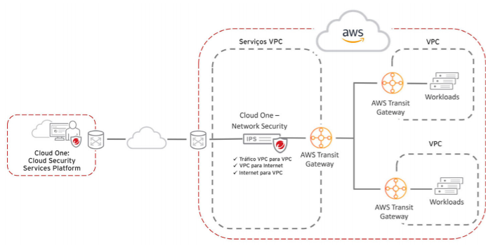

# Cloud One Network Security

### A documentação para o Cloud One - Network Security encontra-se em: 

    - https://cloudone.trendmicro.com/docs/network-security/LearnMore/#learn-more-about-our-product

### A documentação para a API do Cloud One Network Security: A API Pública do Network Security te permite interagir de maneira programatica com o Cloud One Network Security. 

    - https://cloudone.trendmicro.com/docs/network-security/api-reference/

### Para fazer um Trial de 30 dias grátis do Cloud One Network Security e testar a Segurança dos seus File Storage da Nuvem Pública:

    - https://cloudone.trendmicro.com/

 

  
:heart: O QUE É O CLOUD ONE - NETWORK SECURITY 
 

 

<b>O QUE É O CLOUD ONE - NETWORK SECURITY:</b>

<ul> 

<li> Segurança IPS para camada de rede em nuvem </li>

<li> Segurança da camada de rede poderosa, integrada na rede de nuvem, permitindo que você inspecione tráfego de entrada e saída. </li>

<li> Conte rapidamente com segurança de nível empresarial para sua camada de rede, protegendo tudo em suas nuvens virtuais privadas (VPCs). Ao implementá-lo na rede em nuvem, você consegue proteger sua infraestrutura e segmentos de rede rapidamente e com facilidade, com segurança acionável que não atrapalha seu negócio ou seu tráfego. </li>

<li> Indo além dos sistemas tradicionais de prevenção de intrusões (IPS), ele traz virtual patching e detecção pós-invasão como parte integrante de uma plataforma sólida de segurança para nuvem híbrida. </li>

<li> O Network Security oferece cobertura líder do setor em vários vetores de ameaças, oferecendo proteção abrangente contra ameaças, incluindo patches virtuais, proteção contra vulnerabilidades, bloqueio de explorações e defesa de alta precisão contra ataques conhecidos e de zero-day </li>

<li> Usa de inteligência avançada de ameaças e análise de protocolos, detecção de anomalias, indicadores de comprometimento (IOC) e métodos clássicos baseados em assinatura para detectar e proteger você contra classes inteiras de ameaças e suas técnicas, além de ataques específicos. </li>

<li> Diferente de um firewall, você não precisa ver three-way handshakes, nem o início e o fim do tráfego. Você pode começar a inspeção de entrada e saída no meio do fluxo, obtendo proteção imediata. </li>

</ul>

 </img>

 

  
:hand: COMO FUNCIONA O NETWORK SECURITY 

 

<b>COMO FUNCIONA O NETWORK SECURITY? </b>

<b> Network Security na AWS </b>

Amazon Web Services (AWS) allows you to scale your network deployment as needed without investing in hardware appliances. Network Security is offered as an <a href="https://cloudone.trendmicro.com/docs/network-security/create-ami-instance/"> Amazon Machine Image (AMI) </a> . When you decide how to deploy Network Security in your network, we recommend that you choose one of the following deployment options.

Each deployment option is a reference architecture created for different common AWS environments. Choose the option that best suits your existing network structure and inspection needs. These deployment recommendations can also be modified to suit the individual requirements for your network.

    - Para saber mais sobre Recomendações de Deployment:
        - https://cloudone.trendmicro.com/docs/network-security/Deployment%20recommendations/

<b> Recommended deployment options: </b>

<a href="https://cloudone.trendmicro.com/docs/network-security/option1/"> <b> Option 1: Edge protection deployment (recommended): </b> </a> This deployment is designed to protect servers that primarily receive connections from the internet. <a href="https://trendmicro-tippingpoint.s3.amazonaws.com/documentation/pdfs/deployment_checklist_edge.pdf"> Deployment checklist. </a>

This deployment option is best suited to environments that require the following:

<ul> 

A simple network design that protects web servers.

Inspection between the VPC and the Internet as well as between the VPC and a VPN gateway.

A single VPC — this deployment option does not require Transit Gateways.

Third party appliance integration that follows AWS best practices.

</ul>

This deployment option does not indicate an IP address for the true source instance when a NAT Gateway is used.

<a href="https://cloudone.trendmicro.com/docs/network-security/option2/"> <b> Option 2: Private VPC protection: </b> </a> This deployment is designed for AWS architectures that primarily send traffic from EC2 instances to the internet. <a href="https://trendmicro-tippingpoint.s3.amazonaws.com/documentation/pdfs/deployment_checklist_privateVPC.pdf"> Deployment checklist. </a>

This deployment option is best suited to environments that require the following:

<ul> 

Full visibility into source instance and internet destination.

A single set of Network Security instances that scale to thousands of workload VPCs and EC2 instances.

A slight variation on an AWS best practice architecture.

</ul>

This deployment option does not inspect inbound connections. Multiple Transit Gateways are recommended to ensure high availability. <a href="https://cloudone.trendmicro.com/docs/network-security/option2/#transitgw2"> Learn more. </a>

<a href="https://cloudone.trendmicro.com/docs/network-security/option3/"> <b> Option 3: Public and private VPC protection: </b> </a> This deployment is designed to inspect all traffic that originates inside or outside of your network. Traffic is inspected in a services VPC between the Internet Gateway and the Workloads VPCs, which are connected by Transit Gateways. <a href="https://trendmicro-tippingpoint.s3.amazonaws.com/documentation/pdfs/deployment_checklist_public_privateVPC.pdf"> Deployment checklist. </a>

This deployment option is best suited to environments that require the following:

<ul>

Inspection of both inbound and outbound connections.

A flexible architecture that can be modified for specific environment needs.

A single set of Network Security instances that scale to thousands of workload VPCs and EC2 instances.

Security and internet access control with separate VPCs, which can be owned and maintained by separate organizations.

</ul>

This deployment option requires more network components, like VPCs, subnets, gateways, and route tables, than the other deployment options. Multiple Transit Gateways are recommended to ensure high availability. <a href="https://cloudone.trendmicro.com/docs/network-security/option3/#transitgw3"> Learn more. </a>

    - Para saber mais:

        - https://cloudone.trendmicro.com/docs/network-security/Choose%20a%20deployment%20option/

<b> Deploy o Network Security instance na Microsoft Azure </b>

Network Security for Azure allows you to monitor and protect your network traffic by placing Network Security virtual appliances inline in your Azure virtual environment.

Depending on the deployment option you choose, high availability is ensured using Azure Function to monitor and reroute network traffic, manually rerouting traffic rules, or by load balancers. 

Manage your virtual appliances through the Cloud One – Network Security management interface. Use the Azure Monitor log analytics function and the command line interface to monitor the health of your web applications.

    - Para saber mais:
        - https://cloudone.trendmicro.com/docs/network-security/Azure_GettingStarted/

<b> Deployment Options: </b>

 <b> Edge protection deployment with Azure Application Gateway: </b> To deploy internet edge protection using Azure's Application Gateway and to inspect inbound and outbound traffic. In this deployment, Azure Application Gateway is internal (internet-facing) and uses public IP addresses. This deployment uses a hub-spoke topology.

    - Para saber mais:

        - https://cloudone.trendmicro.com/docs/network-security/Azure_Deployment1_ApplicationGateway/

<b> Edge protection deployment with Azure Firewall: </b> This option describes how to deploy your Network Security virtual appliance behind the Azure Firewall to provide advanced network protection. In this topology, the Hub-VNet serves as the point of connectivity to the internet. The Azure virtual appliance lives in the Hub-VNet to share its inspection capability as a service for the Spoke-VNet(s).

    - Para saber mais:
        - https://cloudone.trendmicro.com/docs/network-security/Azure_Deployment1_Firewall/

<b> Private VNet protection deployment: </b> This option describes how to deploy and configure a private VNet deployment in Azure. The private VNet deployment option inspects traffic between internal networks as opposed to inbound and outbound internet traffic. Virtual networks connect through VNet Peering so they can communicate with each other. Traffic inspection will begin after the network and User Defined Routes (UDRs) are set up, and all virtual machine resources within the spoke VNets will communicate with each other through Network Security.

    - Para saber mais:
        - https://cloudone.trendmicro.com/docs/network-security/Azure_Deployment2_PrivateVNet/

<b> Scale set private VNet protection deployment: </b> This option describes how to deploy a scale set of virtual appliances using the private VNet deployment. Deploying a scale set behind the Azure Load Balancer provides additional layers of availability which translates to minimal disruption if a virtual appliance experiences an outage.

    - Para saber mais:
        - https://cloudone.trendmicro.com/docs/network-security/Azure_Deployment3_VMSS/
        

<b> Scale set private VNet protection with Azure Firewall deployment: </b> This option describes how to deploy a scale set of virtual appliances behind the Azure Firewall to provide advanced network protection. Deploying a scale set behind the Azure Load Balancer provides additional layers of availability which translates to minimal disruption if a virtual appliance experiences an outage.

    - Para saber mais:
        - https://cloudone.trendmicro.com/docs/network-security/Azure_Deployment4_VMSS_Firewall/

<b> Scale set edge deployment with Application Gateway: </b> This option describes how to deploy a scale set of virtual appliances with an Azure Application Gateway. The Application Gateway allows you to manage web application traffic. <a href="https://docs.microsoft.com/en-us/azure/application-gateway/overview"> Learn more. </a>

    - Para saber mais:
        - https://cloudone.trendmicro.com/docs/network-security/Azure_Deployment5_VMSS_AGW/

<i> <strong> <a href="https://cloudone.trendmicro.com/docs/network-security/Azure_high_availability/"> High availability (HA) </a> prevents network service disruption after a failure stops your virtual appliance from inspecting traffic. </strong> </i>

 

  
:zap: COMO TESTAR 

 

<b> COMO TESTAR: </b>

    1. Gerencie as instâncias do Network Security na sua VPC usando o CloudWatch;
    2. (Opcional) Configure um alarme no CloudWatch; 
    3. (Opcional) Azure Monitor;
    4. (Opcional) Visualizando eventos de rede no Splunk; 

<b> Gerencie as instâncias do Network Security na sua VPC usando o CloudWatch: </b>

O AWS CloudWatch é uma ferramenta, fornecida pela Amazon, que permite que você gerencie suas instâncias dentro de sua conta AWS. Use o CLI e a Interface de Gerenciamento do Network Security em conjunto com o CloudWatch para monitorar e escalar a sua instância do Network Security.

    - Para saber mais:
        - https://cloudone.trendmicro.com/docs/network-security/Manage_Network_Security_instances/

<b> Configure um alarme no CloudWatch: </b>

O Network Security fornece a capacidade de publicar dados de métricas do CloudWatch com a informação sobre o estado atual do Virtual Appliance. Com esses dados das métricas, defina e configure um CloudWatch alarm para ativar alta disponibilidade em seu ambiente de rede. 

    - Para saber mais:
        - https://cloudone.trendmicro.com/docs/network-security/CloudWatch_high_availability/

<b> Azure Monitor: </b>

O Azure Monitor é uma ferramenta analítica e de insights que monitora a saúde operacional de seus aplicativos e fornece visibilidade da sua implementação do Network Security. Veja mais sobre o <a href="https://docs.microsoft.com/en-us/azure/azure-monitor/overview#:~:text=Azure%20Monitor%20maximizes%20the%20availability,cloud%20and%20on%2Dpremises%20environments.&text=Detect%20and%20diagnose%20issues%20across%20applications%20and%20dependencies%20with%20Application%20Insights."> Microsoft Azure Monitor. </a>

<b>  Visualizando eventos de rede no Splunk: </b>

Você pode configurar o serviço do Network Security para que ele envie os eventos de IPS que gerou para o Splunk server. Antes de iniciar este procedimento, certifique-se de ter o Splunk Application para o Network Security instalado. <a href="https://splunkbase.splunk.com/app/3532/"> Veja mais. </a>

    - Para saber mais:
        - https://cloudone.trendmicro.com/docs/network-security/Connect_Splunk/

