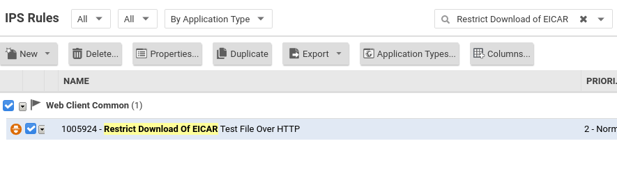

# Cloud One Workload Security
### Links
- [Documentação para o Cloud One Workload Security](https://cloudone.trendmicro.com/docs/workload-security/)
- [Documentação para a API Pública do Cloud One Workload Security](https://cloudone.trendmicro.com/docs/workload-security/api-reference/)
- [Para fazer um Trial de 30 dias grátis do Cloud One e testar múltiplas camadas de segurança em servidores](https://cloudone.trendmicro.com/)

### Índice
1. [O que é?](#what)
2. [Como ?](#how)
3. [Por que?](#why)
4. [Como testar?](#testing)

---
# O que é o Cloud Workload Security (aka. Deep Security)? 
Uma solução projetada para oferecer múltiplas camadas de segurança aos principais tipos de servidores - legados ou modernos, físicos ou na núvem, windows ou linux - através de um agente de segurança

## O que ele faz?
- Oferece 7 módulos distintos de proteção e visiblidade
- Realiza o virtual patching impedindo a exploração de vulnerabilidades do sistema operacional ou nas aplicações em execução no servidor
- Protege contra malwares conhecidos, variantes polimórficas de malwares conhecidos, e novas ameaças através de análise comportamental de processo.
- Registra qualquer desvio de "estado padrão" em portas, processos, arquivos e chaves de registro.
- Agrega, padroniza e filtra por criticidade Logs de sistema, segurança e aplicações. 
- Se integra nativamente com as principais Clouds públicas, trazendo um controle centralizado e visão dinâmica de todos os seus workloads em núvem.
- Possui integração com SIEMs
- Oferece uma API robusta para controle programático dos seus agentes
- Instalável através de um scripts Bash / Powershell, além de pacotes e instaladores tradicionais

# Como? 

Um agente modular é instalado no servidor. Esse agente baixa os componentes de software para cada um dos módulos, trazendo separadamente suas funcionalidades. 

As integrações com as Clouds são feitas à partir de suas respectivas APIs, obtendo através de acessos de leitura, um inventário completo de máquinas rodando em suas contas. 

## Como automatizar?
Existem várias opções para automatizar o deployment e configuração do Workload Security que permitem que ele se encaixe perfeitamente em ambientes altamente dinâmicos e com scaling automático. Algumas opções possíveis são:

- Pré-instalar o agente de segurança em uma Golden Image que utilizada pelos servidores. 
- Colocar o script de instalação como opção de bootstrap de uma instância/VM
- Integrar o Workload Security com o **AWS Systems Manager Distributor** para fazer deploy automático do Agente de segurança. [Leia mais aqui](https://cloudone.trendmicro.com/docs/workload-security/aws-systems-manager/)
- Configurar a instalação em um Virtual Machine Scale Set (VMSS) da Azure. [Leia mais aqui](https://cloudone.trendmicro.com/docs/workload-security/azure-vmss/)
- Fazer o deploy do agente via Ansible, Chef, Puppet, SSH puro ou outras ferramentas.
- Adicione automaticamente toda conta criada pela AWS Control Tower Account Factory. [Leia mais aqui](https://cloudone.trendmicro.com/docs/workload-security/aws-control-tower/)
- Utilize a API RESTful e os SDKs para automatizar as configurações de segurança em seus agentes. [Leia mais aqui](https://cloudone.trendmicro.com/docs/workload-security/api-first-steps/)

# Por que? 

- A exploração de vulnerabilidades é o principal vetor utilizado por atacantes para comprometer servidores publicamente acessíveis
- O comprometimento de um único servidor/VM/instância pode permitir a movimentação lateral de um atacante 
 
# Como Testar? 
Abaixo está o passo-a-passo para testar dois principais módulos de segurança do Workload Security. 

[Leia mais sobre com testar os demais módulos aqui](https://success.trendmicro.com/solution/1098449-testing-the-deep-security-modules)

## Pré-Requisitos
- Uma conta gratuita em https://cloudone.trendmicro.com 
- Um servidor compatível com o agente de segurança
  - Verifique requisitos mínimos de Hardware [aqui](https://cloudone.trendmicro.com/docs/workload-security/sizing/). Um [Relay](https://cloudone.trendmicro.com/docs/workload-security/relay-quick/) é um agente que é configurado para redistribuir Software do Workload Security e Updates de Segurança para outros agentes. **Não** usaremos relays nesse teste.
  - Verifique a compatiblidade do Sistema Operacional onde o agente será instalado, [aqui](https://cloudone.trendmicro.com/docs/workload-security/agent-compatibility/)
  - Se a máquina for **Linux**, verifique se o Kernel é suportado pelo agente de segurança [aqui](https://cloudone.trendmicro.com/docs/workload-security/agent-linux-kernel-support/)
- O servidor deverá ser capaz de se comunicar via **HTTPS** com os domínios da Trend Micro. Saiba mais [aqui](https://cloudone.trendmicro.com/docs/workload-security/communication-ports-urls-ip/)
  - Se a máquina estiver atrás de um proxy HTTP, SOCKS4 ou SOCKS5, veja [aqui](https://cloudone.trendmicro.com/docs/workload-security/proxy-set-up/#Register) sobre como configurar o Workload Security para utilizá-lo.

## Instalando o agente

- Acesse a console do Cloud One Workload Security. 
- Gere um script de instalação de agente em: `Administration > Updates > Software > Local > Generate Deployment Script`

- Selecione o tipo de SO. Se você precisou configurar um proxy, selecione-o no menu. Salve ou copie o script.

- Execute o Script na máquina. Um código HTTP 200 Indica que a instalação foi bem sucedida e que o agente se comunicou com a console. Verifique na console se ele o computador está listado em `Computers`

## Testando o Módulo de Intrusion Prevention

Em `Computers`, clique duas vezes no computador sendo testado. Acesse o módulo de intrusion prevention. 
1. Habilite-o mudando sua "Configuration" para **On**  
2. Altere seu comportamento para **Prevent**
3. Sob "Assigned Intrusion Prevention Rules" clique em "Assign/Unassign".

Na parte superior da nova tela, pesquise por "Restrict Download of EICAR" na barra de pesquisa.

Assinale a regra como na foto abaixo, clique "OK" e depois "Save" para salvar a configuração.

Essa regra está sendo aplicada ao computador. Ela irá detectar, para o protocolo HTTP especificamente, a assinatura do arquivo EICAR de testes de anti-malware e impedir que os pacotes passem da stack de rede do sistema operacional. 

Tente baixar o arquivo via HTTP.

    $ wget http://www.eicar.org/download/eicar.com

O download irá falhar. Verifique os eventos de Intrusion Prevention na Janela do computador

## Testando o Módulo de Anti-Malware

Habilite o módulo de Anti-Malware, em "Real Time Scan" selecione "Aggressive Real-Time" na opção "Malware Scan Configuration" e selecione "Every Day all Day" em Schedule.

Salve as alterações na configuração de segurança.

Aguarde enquanto o agente recebe a atualização de política e instala os componentes de software. 

Assim que o Estado do Anti-Malware estiver como "On, Real Time", tente baixar à partir da máquina de testes o arquivo do EICAR no link abaixo

https://secure.eicar.org/eicar.com

Uma detecção ocorrerá em Anti-Malware Events

## Integrando com as Clouds
Dentro da tela de Computers, no botão de "Add", é possível abrir os wizards de conexão com cada uma das clouds suportadas. 

