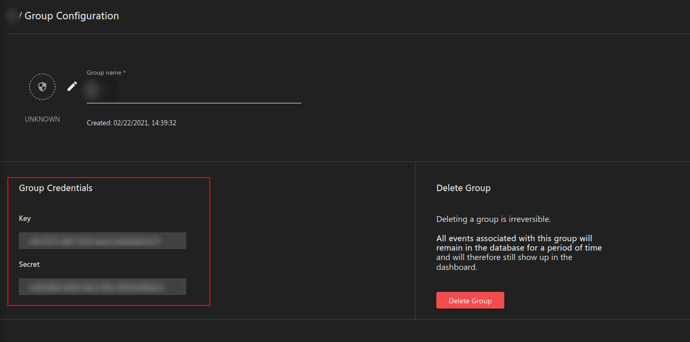
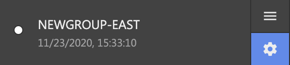
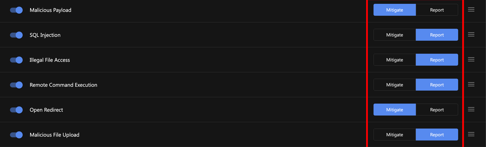
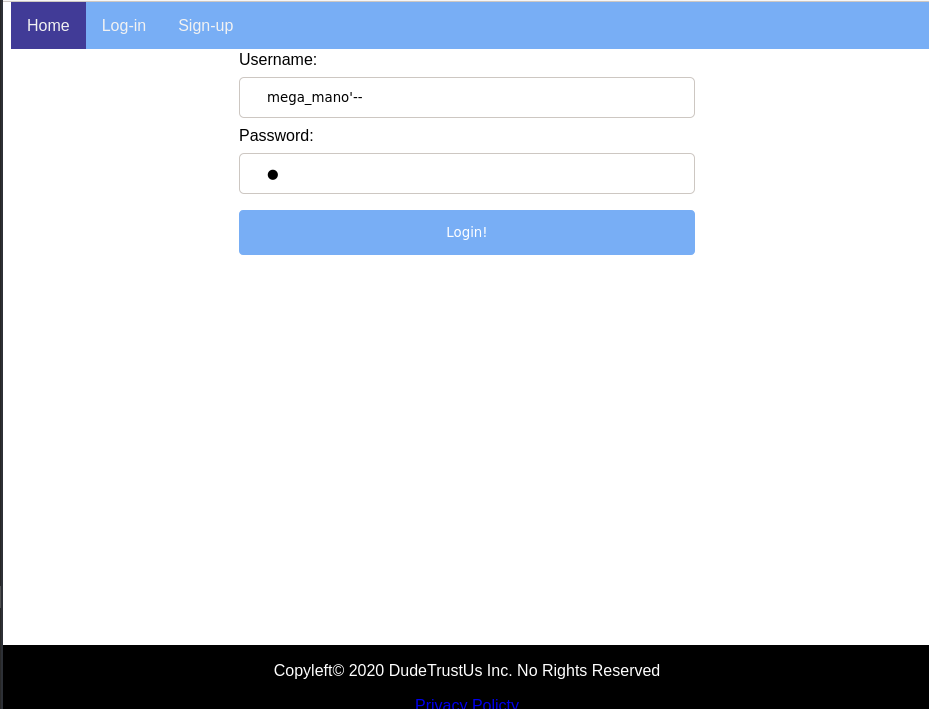

# Cloud One Application Security

1. [O que faz?](#what)
2. [Como ?](#how)
3. [Por que?](#why)
4. [Como testar?](#testing)

---

# O que faz? <a name="what"></a>
* Oferece segurança em tempo de execução para aplicações web e funções serverless
* Protege contra vulnerabilidades OWASP Top 10 e outros
* Protege contra vulnerabilidades zero-day
* Traz visibilidade das tentativas de ataques contra sua exploração, como:
  * Tipo de ataque
  * Detalhes do request HTTP
  * Stack de código que lida com aquele request
* Aproxima equipes de desenvolvimento e segurança, trazendo informações relevantes e acionáveis à ambas.

## O que _não_ faz?
* Não faz gestão de dependências
* Não faz análise estática ou dinâmica do código
  * i.e., ele não é um SAST ou DAST


# Como ?<a name="how"></a>
* Em Aplicações o Agente de proteção é embutido como uma dependência. Em funções lambda, o agente é embutido através de uma nova layer. Em ambos os casos _**não há alterações no código**_


# Por que? <a name="why"></a>
Atacantes determinados estão constantemente varrendo seu site e aplicações, criando contas maliciosas de usuários, realizando fuzzing, e tentando executar ferramentas de exploração de vulnerabilidades.

Eles fazem isso para:
- obter contas de usuários ou administradores
- executar códigos arbitrários no seu servidor
- vazar dados sensíveis de sua aplicação

# Como Testar <a name="testing"></a> </summary>


Assumindo que você já criou uma conta gratuita em https://cloudone.trendmicro.com 

## Criando um novo Security Group

Security Groups são usados para definir as políticas de segurança de sua aplicação. Acessando a interface do Application Security, clique em "Add New Group".


Grupos de segurança
As credenciais (Key e Secret) irão aparecer na próxima tela. Elas serão usadas nos próximos passos para que o agente de segurança se comunique com a Dashboard. 


Você pode consultar as credenciais do seu grupo de segurança a qualquer momento, clicando na opção de "Configurações" (a engrenagem) do lado do nome do grupo.



Acesse a configuração de políticas do grupo de segurança (menu "Hamburguer") e habilite as seguintes políticas no modo "Report"



## Usando a aplicação Headpage
Vamos testar com uma aplicação propositalmente vulnerável. 

### Pré-requisitos
- git
- Docker
- curl

### Instalação
```
git clone https://github.com/SecurityForCloudBuilders/Protect-a-Vulnerable-WebApplication.git

cd HeadPage/
```

(Opcional) Para que máquinas além do localhost acessem a aplicação, edite o arquivo `src/headpage/settings.py` e coloque a seguinte linha:
```
ALLOWED_HOSTS = ['*']
```

(Opcional) Você pode criar um arquivo `trend_app_protect.ini`  com o seguinte conteúdo. Substitua "my-key" e "my-secret" pelas credenciais do seu grupo de segurança.
```
[trend_app_protect]
key = my-key
secret = my-secret
```

Faça o build da imagem

```
docker build --tag=headpage:latest .
```

Se você criou o arquivo `trend_app_protect.ini`:
```
docker run -d --rm -p 8000:8000 --name headpage headpage:latest
```

Caso contrário, coloque o seguinte comando. Substitua "my-key" e "my-secret" pelas credenciais do seu grupo de segurança.

```
docker run -d --rm -p 8000:8000 --name headpage -e TREND_AP_KEY=my-key -e TREND_AP_SECRET=my-secret headpage:latest
```

### Testando as políticas de segurança
Para cada um dos seguintes testes, realize-o da primeira vez com a política de segurança em modo **Report**. Depois, altere para modo **Prevent** e tente executar o ataque de novo.

#### Testando malicious payload

    curl -H "User-Agent: () { :; }; /bin/eject" http://127.0.0.1:8000

#### Testando SQL Injections



#### Testando Open Redirects

Acesse a seguinte URL e logue como um usuário para ser redirecionado para o google
    
    127.0.0.1:8000/social/login/?redirect=https://google.com


#### Testando Illegal File Access
Acesse a seguinte URL para vazar o arquivo `/etc/passwd`

    127.0.0.1:8000/social/static/?file=../../../../../../../../etc/passwd

#### Testando Remote Command Execution
No campo "Or choose Picture from URL" adicione o seguinte conteúdo, e clique "Update Profile"

    ; touch evil.sh #
