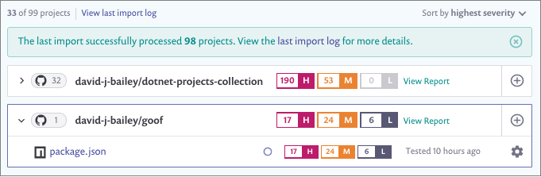

#   Open Source Security by Snyk

### A documentação para o Cloud One – Open Source Security by Snyk encontra-se em: 
-   https://cloudone.trendmicro.com/docs/open-source-security-by-snyk/

### Para fazer um Trial de 30 dias grátis do Open Source Security by Snyk e averiguar se as suas dependências do seu código te expõe a vulnerabilidades 
-   https://cloudone.trendmicro.com/

 

 

### Como Funciona:

Ele fornece detecção de vulnerabilidades de código aberto em repositórios de código-fonte e pipelines de construção.
A maioria dos aplicativos de software faz uso intenso de componentes de código aberto. Esses componentes são criados por terceiros e podem conter falhas de segurança de software que podem afetar a segurança de seus aplicativos.

1.	Conecte o Cloud One - Open Source Security by Snyk ao seu repositório de código-fonte (GitHub, GitLab, etc.) ou ao pipeline (Jenkins, TeamCity, Circle CI, etc) Para obter instruções, <a href="https://cloudone.trendmicro.com/docs/open-source-security-by-snyk/get-started">  para ver mais. </a>
2.	O Open Source Security by Snyk fará a varredura das dependências do código-fonte e fornecerá uma avaliação priorizada do risco do código-fonte aberto.
3.	Em alguns casos, fornece conselhos de correção acionáveis para seus desenvolvedores e monitore as melhorias ao longo do tempo.
4.	Responda a novas vulnerabilidades rapidamente com uma visão imediata de quantos projetos são afetados por uma nova vulnerabilidade.

 

 </img>

 

 

### Veja o passo a passo para testar na documentação:

-   https://cloudone.trendmicro.com/docs/open-source-security-by-snyk/get-started/#add-source-control-integration