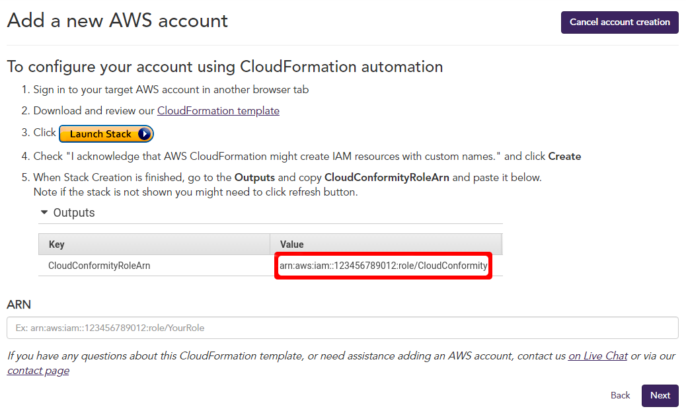
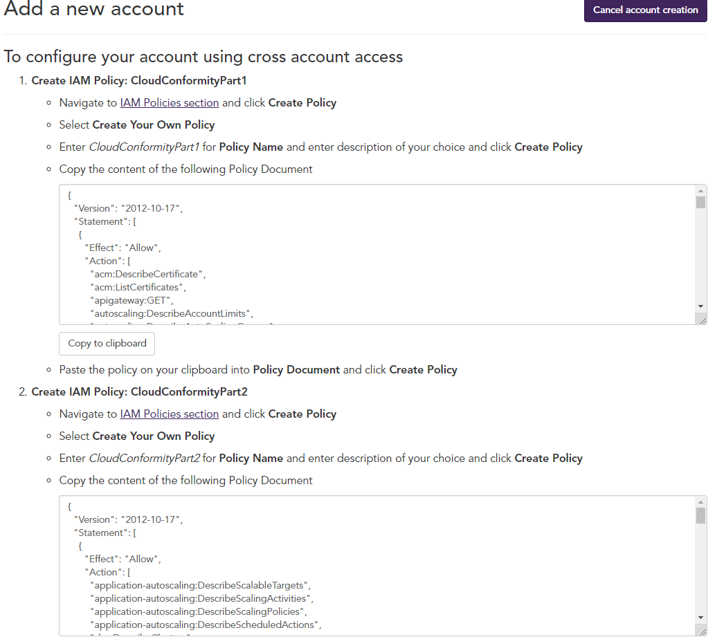
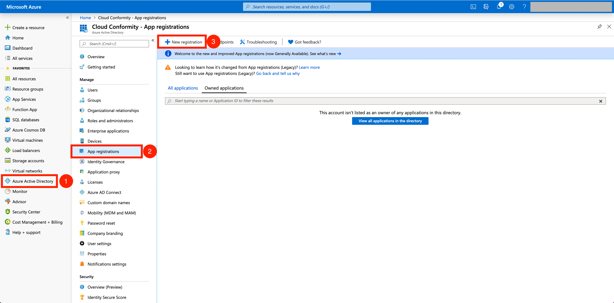
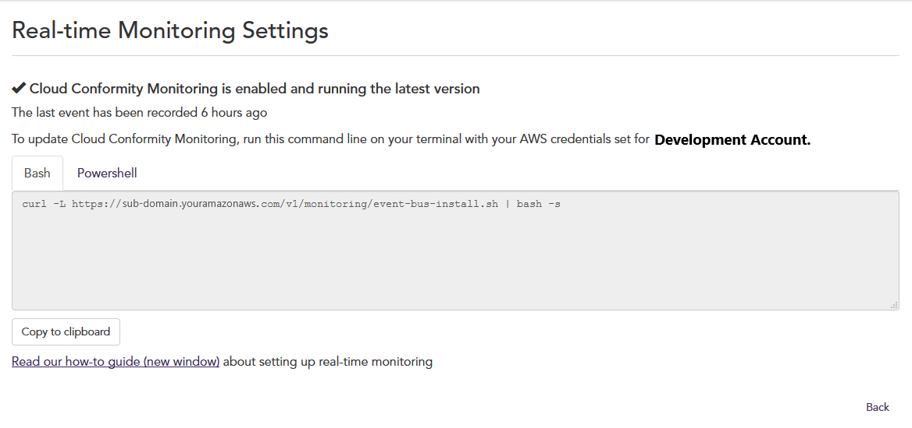
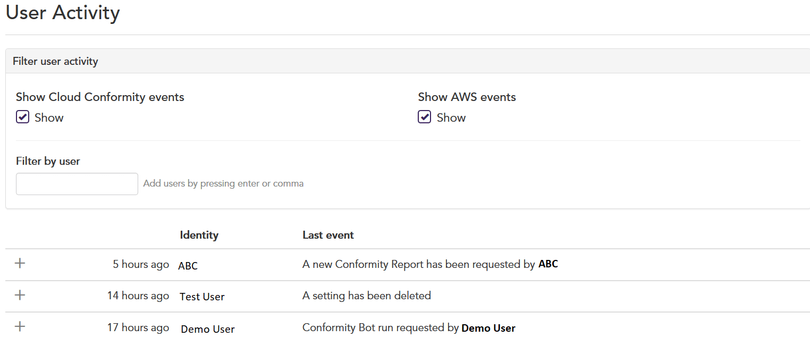
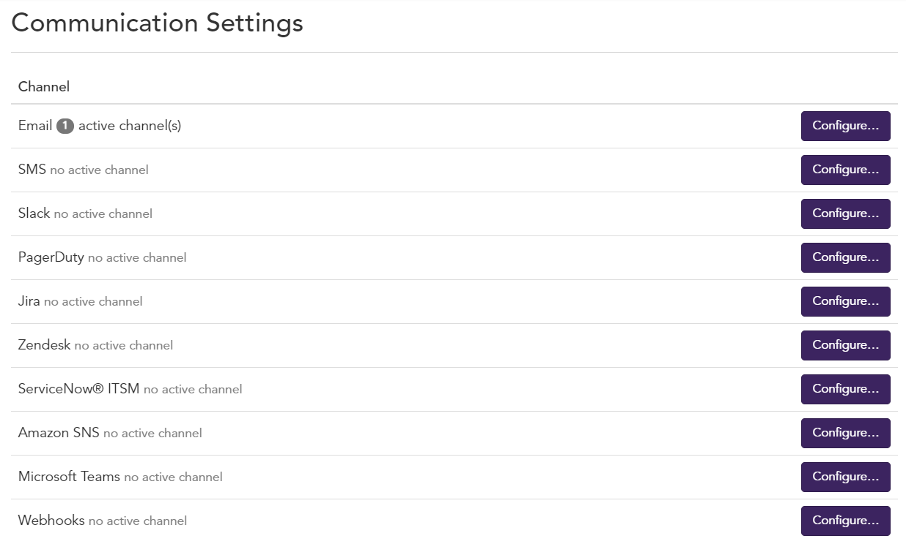
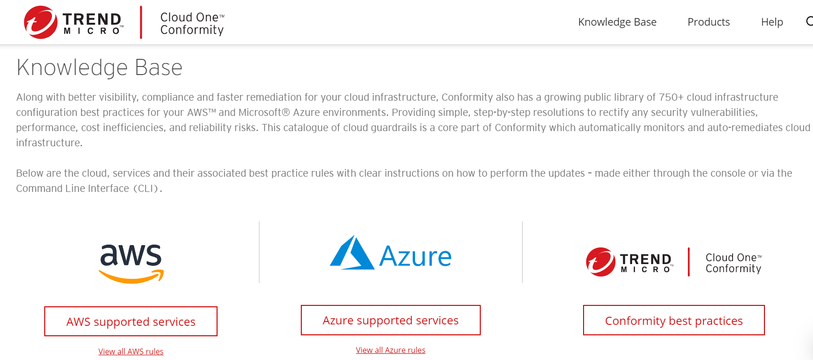
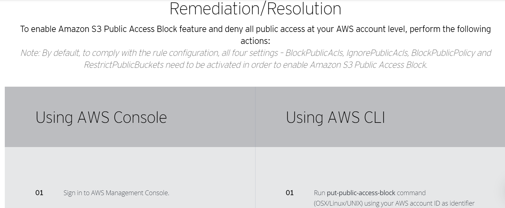
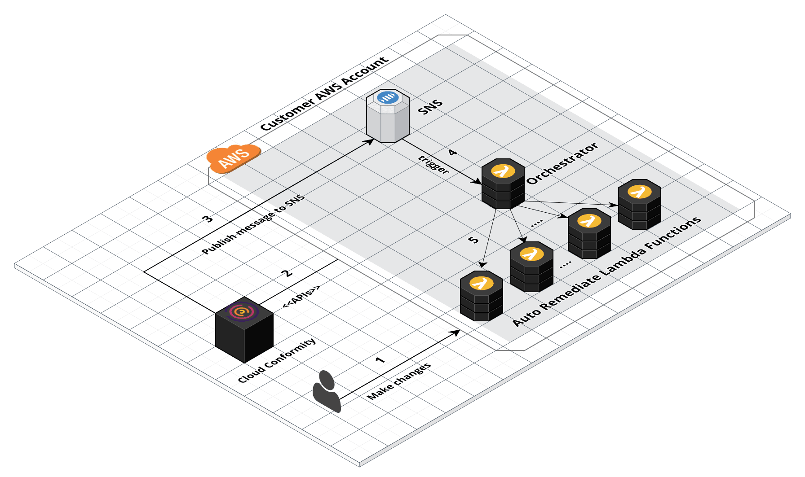

# Cloud One Conformity

### A documentação para o Cloud One - Conformity encontra-se em: 

    - https://www.cloudconformity.com/help/organisation/cloud-accounts/add-cloud-account.html

### A documentação para a API do Cloud One Conformity: A API Pública do Conformity te permite interagir de maneira programatica com o Cloud One Conformity. 

    - https://cloudone.trendmicro.com/docs/conformity/api-reference/

### Para fazer um Trial de 30 dias grátis do Cloud One Conformity e testar a Segurança, Conformidade e Governança da sua Infraestrutura da Nuvem Pública:

    - https://cloudone.trendmicro.com/

 

  
:heart: O QUE É O CLOUD ONE - CONFORMITY: 

 

<b>O QUE É O CLOUD ONE - CONFORMITY:</b>

<ul>

 

<li> Visibilidade em tempo real de Segurança, Compliance e Governança de Vulnerabilidades na sua Infraestrutura de NUvem Púlica </li>

<li> Um guide Passo a Passo de Remediação </li>  

<li> Abordagem automatizada para segurança com garantia contínua </li>

<li> Uma Dashboard Centralizada </li>

<li> Visibilidade total e clara de toda a infraestrutura em nuvem </li>

<li> Verificações contínuas em relação aos padrões de conformidade e práticas recomendadas de segurança </li>

<li> Extensos recursos de relatórios </li>

<li> 700+ de regras com action steps </li>

<li> Recursos de correção manual e auto-remediação </li>

<li> Monitoramento e alertas em tempo real </li>

<li> Shift security & compliance left </li>

<li> Template scanning </li>

<li> API Poderosa </li>

</ul>

 

  
:hand: COMO FUNCIONA O CONFORMITY 

 

<b>COMO FUNCIONA O CONFORMITY? </b>

O Conformity usa uma política de acesso personalizada para visualizar apenas os metadados da sua conta em nuvem – <b>não há acesso de leitura ou
gravação aos seus dados </b>

<i> O Conformity acessa apenas os metadados associados à sua infraestrutura de cloud. </i> <b> Por exemplo, reconhecemos que sua conta da AWS possui 12 buckets do Amazon S3 e 20 instâncias do Amazon EC2. Entretanto, a Trend Micro não pode ver os dados e aplicações associados a esses recursos e acessa sua conta por meio da API da AWS; portanto, sua conta em nuvem não aumenta. </b> 

<i> O Conformity remonta aos frameworks das melhores práticas para os provedores de serviços de nuvem. </i> <b> Por exemplo, para a AWS, o Well-Architected Framework constitui a base das pontuações de conformidade mostradas no Conformity, e cada regra e etapa de correção exibe claramente qual pilar ele suporta. </b>

O Conformity possui a <a href="https://www.cloudconformity.com/knowledge-base/"> Knowledge Base </a>, principal catálogo de regras e controles de infraestrutura diretamente disponíveis em sua plataforma. A Knowledge Base, em constante crescimento, contém mais de 750 verificações prontas para uso que são executadas nas suas contas de nuvem e as regras simples e passo a passo de correção para corrigir eventuais falhas. Essas regras e controles abrangem a AWS e o Microsoft® Azure™, além de diretrizes de correção personalizadas.

### Adicionar uma conta da AWS no Trend Micro Cloud One:

As contas da AWS podem ser adicionadas ao Trend Micro Cloud One ™ duas maneiras:

<b>Automática: </b>

<b> <strong> Na maneira Automática, as contas são adicionadas usando AWS Cloudformation. O Template do Cloudformation do Conformity inclue a Conformity <a href="https://www.cloudconformity.com/help/conformity-bot/aws-integration/aws-custom-policy.html"> Custom Policies </a> Parte 1 e 2 como também a criação da Stack do CloudFormation, uma IAM Role também é criada. Essa Role, por sua vez, dá acesso a cross account para que o Conformity possa acessar sua conta! <strong> </i>

 </img>

<b>Manual: </b>

<b> <strong> Você irá precisar criar uma IAM Role na qual garante acesso cross-account para que o Conformity possa acessar a sua conta da AWS. Você também terá que criar 2 IAM Policies e anexar nessa IAM Role que criou. <strong> </i>

 </img>

    Para saber mais :

        - https://www.cloudconformity.com/help/add-cloud-account/add-an-aws-account.html

### Adicionar uma Subscrição da Azure:

<i> <strong> Acesso a Azure é fornecido via um Azure App registration, na qual oferece a Engine de Regras do Conformity as permissões de somente leitura necessárias para executar as verificações de regra contra os recursos das Subscrições que você quer adicionar a sua Conta do Conformity. </i> </strong>

    1. Crie um App registration;
    2. Configure Certificates and secrets;
    3. Permissões da API para o ActiveDirectory;
    4. Atribuir acesso ao App registration para as Subscriptions;

 </img>

    Para saber mais:

        - https://www.cloudconformity.com/help/add-cloud-account/add-an-azure-account.html

 

  
:zap: COMO TESTAR 

 

<b> COMO TESTAR: </b>

    1. Habilite o Monitoramento em Tempo Real;
    2. Configure um Canal de Comunicação;
    3. Remedie com o KNOWLEDGE BASE; 
    4. (Opcional) Habilite o Auto Remediate;
    5. Escaneie Templates do AWS CloudFormation para ver quais são as Recomendações de Melhores Práticas para eles;

### Monitoramente em Tempo Real de eventos que acontecem na sua conta da AWS

<b> REAL-TIME MONITORING </b> 

<i> <strong> O Trend Micro Cloud One – Conformity oferece o Real-Time Threat Monitoring (RTM) add-on que provêm monitoramento em tempo real com Alertas instantâneos de ameaças e remediação para atividades e eventos em sua conta da AWS. </i> </strong>

<b> 2 pontos chaves são oferecidos com o add-on do RTM </b> 

<a hfer="https://www.cloudconformity.com/help/real-time-threat-monitoring/activity-dashboard.html"> Activity Dashboard </a> identifique atividades incomuns 
<a hfref="https://www.cloudconformity.com/help/real-time-threat-monitoring/monitoring-dashboard.html"> Monitoring Dashboard </a> Obtenha informações detalhadas de eventos em uma conta da AWS

 </img>

<b> Como Configurar o Real-Time Monitoring </b>

1. Para adicionar o add-on do Real-Time Monitoring na sua conta. Você pode fazer isso:  

    1. <a href="https://www.cloudconformity.com/help/add-cloud-account/add-an-aws-account.html"> Enquanto você está adicionando a sua conta no Conformity </a> 
    2. <a href="https://www.cloudconformity.com/help/organisation/subscriptions.html"> Após você adicionar a sua Conta no Conformity </a> 

2. Siga as instruções para <a href="https://www.cloudconformity.com/help/real-time-threat-monitoring/real-time-threat-monitoring-settings.html"> configurar o Real-Time Monitoring </a>

 </img>

    - Para saber mais:
    
        - https://www.cloudconformity.com/help/real-time-threat-monitoring.html

### Consiga receber alertas e notificações vindas do Conformity em seus canais de Comunicação

<b> COMMUNICATION SETTINGS </b> 

<i> <strong> O Conformity oferece integração com múltiplas ferramentas de comunicação de terceiros e principais sistemas de ticketing. Cada um deles pode ser personalizado para criar vários canais que poderão ser configurados e te notificar ​​para ajudar a se adequar ao seu fluxo de trabalho da sua organização. </i> </strong>

 </img>

    - Para saber mais:

        - https://www.cloudconformity.com/help/communication/communication-channels.html

### Base de Conhecimento pública com passo a passo de mais de 750 recomendações de melhores práticas

<b> KNOWLEDGE BASE! </b>

<i> <strong> Junto com uma melhor Visibilidade, Compliance e Remediação mais rápida para sua infraestrutura em nuvem, o Conformity também tem uma <a href="https://www.cloudconformity.com/knowledge-base/"> Base de Conhecimento pública </a> com mais de 750 recomendações de melhores práticas de configuração da sua infraestrutura em nuvem para seus ambientes AWS e Azure. Fornecendo soluções simples com passo a passo para corrigir vulnerabilidades de Segurança, Desempenho, Ineficiências de Custo e Riscos de Confiabilidade. </i> </strong>

 </img>

 </img>

### Como manter a minha Infraestrutura Segura em Tempo Real e Automaticamente

<b> AUTO-REMEDIAÇÃO! </b>

<a href="https://www.cloudconformity.com/help/rules/model-check/failed-check-resolution/auto-remediation.html" > Auto-Remediação </a> fornece a você a capacidade de executar Lambda Functions prontas na sua Infraestrutura que podem remediar as falhas de Segurança e Governança em tempo real. Consulte nossa outra página no GitHub para uma <a href="https://github.com/cloudconformity/auto-remediate/tree/master/functions"> lista da nossas Lambdas Functions de Auto-Remediação.</a>

 </img>

<b> Como a Auto-Remediação Funciona: </b>

<i> <strong> Exemplo da Auto-Remediação agindo ao ter um S3 Bucket mal-configurado: </strong> </i>

    1. O Conformity identifica o risco como uma regra que falhou;
    2. Conformity envia uma notificação para o canal SNS especificado;
    3. O Tópico SNS aciona a Lambda Function Orquestradora que por sua vez chama a Lambda Function S3 Bucket Auto-Remediate;  
    4. A função AutoRemediateS3-001 atualiza a ACL do S3 Bucket e resolve a regra que falhou fechando assim a lacuna de segurança.

### Ferramentas para testar a sua Segurança antes do deploy da sua Infraestutura:

<b> TEMPLATE SCANNER! </b>

<i> <strong> O Template Scanner add-on permite você a executar as regras do Conformity nos seus Templates do AWS CloudFormation, Conformity Profiles, e Contas. Com isso, você pode adicionar controles preventivos de Segurança e Governança ao fluxo de trabalho para identificar e corrigir problemas antes de lançar quaisquer serviços e recursos. </i> </strong>

<b> Você pode usar o Template Scanner de algumas maneiras: </b>

1. <a href="https://www.cloudconformity.com/help/template-scanner.html#scan-via-ui">Scanning um CloudFormation Template, Profile, ou uma Account via UI; </a>
2. <a href="https://github.com/cloudconformity/documentation-api/blob/master/TemplateScanner.md"> API do Template Scanner </a>
3. <a href="https://github.com/raphabot/cloud-conformity-vscode-extension"> Cloud One Conformity VSCode Extension </a> Criado por <a href="https://github.com/raphabot"> Raphael Bottino </a>  

